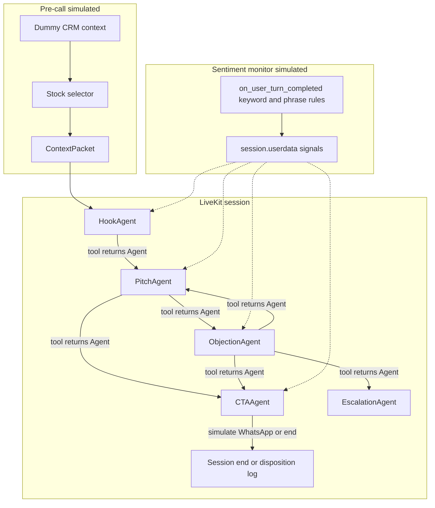

# Multi-agent outbound sales voice agent

## Current baseline

- [voice_agent/my-agent/src/agent.py](voice_agent/my-agent/src/agent.py): one `Assistant(Agent)`, outbound opening via `_run_outbound_opening`, job metadata in `ctx.job.metadata` JSON.
- Tests: [voice_agent/my-agent/tests/test_agent.py](voice_agent/my-agent/tests/test_agent.py) import `Assistant` and use `AgentSession` for LLM-judge scenarios.

## Target architecture (matches your diagram)

**Orchestration**: There is no separate LLM “orchestrator” process (that would add latency). The **conversation state machine** is implemented as **explicit stage agents** plus **shared `userdata`** (`stage`, `objection_cycles`, `active_signals`, `last_user_text`) and **handoff tools** that return the next `Agent` instance—the pattern LiveKit documents for workflows ([AGENTS.md](voice_agent/my-agent/AGENTS.md) handoffs/workflows; SDK behavior: returning an `Agent` from a tool triggers `AgentSession.update_agent` in `agent_activity.py`).

**Parallel sentiment monitor**: A real background thread is unnecessary and can race the voice pipeline. Implement the monitor as **deterministic, synchronous-then-async-safe analysis** on each user turn:

- Override `on_user_turn_completed` on a small **shared base class** (e.g. `SalesCallAgent`) used by Hook / Pitch / Objection / CTA / Escalation agents.
- Parse the user’s final transcript (string from `new_message`), update `userdata` signals: `BUY_INTENT_HIGH`, `FRUSTRATION_RISING`, `READY_TO_CLOSE`, `COMPLIANCE_TRIGGER` (keywords: fraud, SEBI, regulator, scam, lawyer, etc.—tune for Indian English variants).
- Inject a **single short internal system line** into the **mutable `turn_ctx` copy** LiveKit passes into `on_user_turn_completed` (SDK comment: edits apply to the **current** generation only)—e.g. `Internal signals: COMPLIANCE_TRIGGER`. Pair with agent instructions: “If internal signals include COMPLIANCE_TRIGGER, your **only** action is to call `handoff_to_escalation` (or equivalent) before any sales content.”

**Escalation**: Dedicated `EscalationAgent` with a fixed compliance-first script (no stock pitch, no promises). Reached via tool return from any stage when signals demand it.

## Dummy data and context packet

Add a small module (new file, keep [agent.py](voice_agent/my-agent/src/agent.py) as thin entrypoint per AGENTS.md), e.g. [voice_agent/my-agent/src/sales_context.py](voice_agent/my-agent/src/sales_context.py):

- **Dataclasses / TypedDicts** for: client profile (name, risk, segment cash/FNO, sophistication), balances, watchlist, last login, **past tip performance** (wins/losses, names), sector exposure, **playbook snippets** (optional per-client overrides).
- **`DEFAULT_DUMMY_CONTEXT`**: one rich fictional client (e.g. “Gaurav”) aligned with your narrative: past HDFC win, 8/11 intraday win rate, conservative/aggressive flag, available cash, FNO eligibility.
- **`select_scrip(context) -> Recommendation`**: pure Python “stock selector” implementing your rules (risk → cap tier, segment eligibility, cash-based ticket sizing, sector concentration cap). Returns symbol, entry, target_pct, stop, 2–3 bullet rationales (technical + fundamental **placeholders** clearly labeled as illustrative for demo).
- **`build_context_packet(payload: dict) -> ...`**: merge `ctx.job.metadata` overrides (e.g. `user_name`, `risk_profile`, `cash_inr`, `fno_enabled`) onto defaults so you can demo different profiles without a CRM.

## Specialist agents (focused prompts, minimal tools)

Implement in e.g. [voice_agent/my-agent/src/sales_agents.py](voice_agent/my-agent/src/sales_agents.py) (names illustrative):

| Agent | Role | Tools (examples) |
|-------|------|------------------|
| `HookAgent` | 15–20s: name, past win/app hook, urgency, busy → callback offer | `handoff_to_pitch`, `handoff_to_escalation` |
| `PitchAgent` | One crisp line: scrip + entry + target% + SL; 2–3 bullets; **mandatory SEBI-style disclaimer** in instructions (spoken once here); calibrate jargon from `context.sophistication` | `handoff_to_objection`, `handoff_to_cta`, `simulate_rag_snippet`, `simulate_live_quote`, `handoff_to_escalation` |
| `ObjectionAgent` | Classify objection (price, loss, timing, trust, busy, capital); map to your **playbook** text from context/dummy data; track `userdata.objection_cycles` (max 2) | `handoff_to_pitch`, `handoff_to_cta`, `handoff_to_escalation` |
| `CTAAgent` | Direct dealer ask, one nudge, capture YES/CALLBACK/DECLINED | `simulate_whatsapp_summary`, `simulate_crm_disposition`, `end_call` (or session close pattern per SDK) |
| `EscalationAgent` | Human-in-the-loop script; no advice | `acknowledge_escalation` / end |

**SEBI / guardrails**: Keep prompts short; embed a **fixed disclaimer string constant** and “no guaranteed returns / not personalized advice” rules in `PitchAgent` + reminder lines in CTA. Turn caps: store `assistant_turn_count` or `stage_entered_at` in `userdata` if you want hard caps later (optional first slice: objection loop only).

## `agent.py` wiring

- Parse metadata as today; call `build_context_packet(payload)`.
- Construct `AgentSession(..., userdata=CallState(...))` with the same STT/LLM/TTS/VAD/noise setup you already have.
- `await session.start(agent=HookAgent(...), ...)` instead of `Assistant`.
- **Opening**: Either keep `_run_outbound_opening` for the very first utterance **or** rely on `HookAgent.on_enter` + `session.generate_reply`—pick one path to avoid double greeting (prefer **`HookAgent.on_enter`** with `allow_interruptions=False` for first line if you drop `_run_outbound_opening` for this flow).
- Preserve `inference_models_from_job_payload` and existing metadata keys for backward compatibility.

## Simulated tools (no external services)

- `simulate_rag_snippet`, `simulate_live_quote`: return static/deterministic strings derived from `Recommendation` (log “would call RAG / market API”).
- `simulate_whatsapp_summary` / `simulate_crm_disposition`: `logger.info` structured JSON (disposition CONVERTED/CALLBACK/DECLINED, objection tag)—acts as stand-in for WhatsApp + CRM + “data lake” ingestion hooks.

**Memory tiers from diagram**: Document in code comments only: org vector / episodic SQL / lake are **integration points** behind these tools when real backends exist—no new infra in this slice.

**Langfuse / judge**: Out of scope unless you add dependencies; optional `logger.info` trace fields (`stage`, `signal`) for later OTEL/Langfuse wiring.

## Testing (TDD per AGENTS.md)

Extend [voice_agent/my-agent/tests/test_agent.py](voice_agent/my-agent/tests/test_agent.py) and/or add `tests/test_sales_context.py`:

- **Unit tests (no LLM)**: `select_scrip` / `build_context_packet` merging; `analyze_signals(text)` for compliance keywords and a few buy-intent phrases.
- **Optional lightweight agent test**: Start `AgentSession` with only `PitchAgent` + user input asking for a tip; judge that response includes disclaimer + no “guaranteed” language (similar to existing `test_stock_advice_has_disclaimer_and_questions` but bound to the new agent class).

Keep existing `inference_models_*` tests; adjust `Assistant` tests if `Assistant` is removed—either retain a thin `Assistant` alias for compatibility or update imports to the new primary agent class.

## Files to touch

| File | Change |
|------|--------|
| [voice_agent/my-agent/src/agent.py](voice_agent/my-agent/src/agent.py) | Wire session, userdata, opening, delegate to new modules |
| New: `src/sales_context.py` | Dummy CRM, packet builder, selector |
| New: `src/sales_agents.py` | Base monitor + stage agents + `@function_tool` handoffs |
| [voice_agent/my-agent/tests/test_agent.py](voice_agent/my-agent/tests/test_agent.py) | New cases + migrate old assistant tests if needed |

## Risks and mitigations

- **Latency**: Keep each agent’s system prompt tight; only attach **serialized context packet summary** (bullet list), not full JSON dumps.
- **Handoff + tool reply**: SDK sets `reply_required` based on tool output; returning **only** an `Agent` may skip follow-up LLM text—verify in implementation that the user always hears a transition line (use `on_enter` on the next agent to speak if needed).
- **Compliance**: Automated keyword escalation is a **demo simulation**; production needs human review and legal sign-off on scripts.
